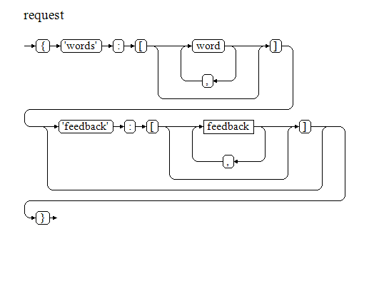
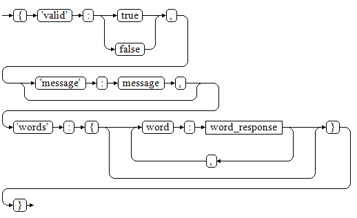
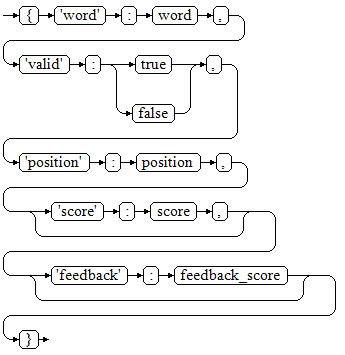

# robco_rootkit
Django project for the for the hacking of Robco terminals in the video game series Fallout by Bethesda.

# Installation
This project requires the django project to be installed. It has been tested on using Python 2 and Python 3 as well as Django 1.9 and 1.10.

# API
This project is intended as a demonstration of utilizing Django as a JSON API.  The processing is simple enough to not require an API, but I would like to see this project utilized in other mediums such as native apps.

All requests should be JSON objects posted to the /api URL. The service will respond with a response object as documented below.

## Request Object Syntax

```EBNF
request = "{" "'words'" ":" "[" [ word  { "," word } ] "]" \n ["'feedback'" ":" "[" [ feedback { "," feedback  } ] "]" ] \n "}" .

feedback = "{" "'word'" ":" word "," "'feedback'" ":" feedback_score "}" .
```




## Response Object Syntax

```EBNF
response = "{" "'valid'" ":" ( true | false ) "," \n [ "'message'" ":" message "," ] \n "'words'" ":" "[" [ word_response {"," word_response} ] "]" \n "}" .

word_response = "{" "'word'" ":" word "," \n "'valid'" ":" ("true" | "false") "," \n "'position'" ":" position "," \n [ "'score'" ":" score "," ] \n [ "'feedback'" ":" feedback_score ] \n "}" .
```




